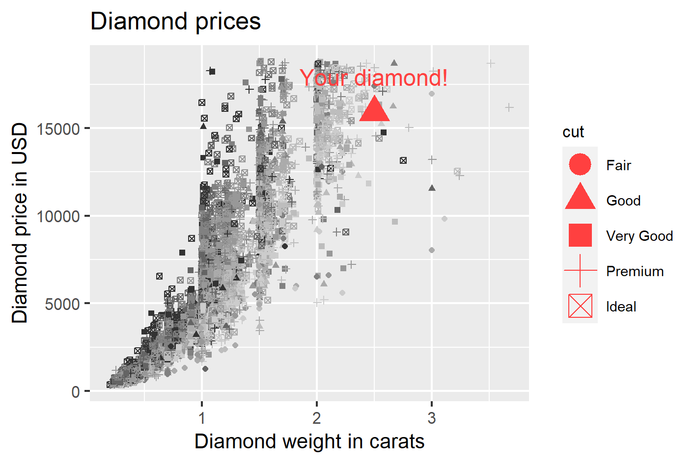

Diamond price prediction (ShinyApp)
========================================================
author: Marko Intihar
date: January 8th, 2021
autosize: true

The ShinyApp
========================================================

Have you wondered hot to estimate the price of your diamond?

Given ShinyApp:

- will help you estimate yor diamond's price 
- using simple statistical prediction linear model 
- that is fitted using data set of over 50.000 actual diamonds (selected diamond features and diamond prices as prediction variable).

ShinyApp is available on provided website:
 - <https://inti.shinyapps.io/diamond_price_prediction/>


User Input
========================================================

User selects ShinyApp's inputs using slider buttons and radio buttons. Provided inputs are:

- **Number of diamonds** drawn on the diamond plot 
- **User's diamond's weight** (feature used in the model)
- **User's diamond's color** (feature used in the model)
- **User's diamond's cut** (feature used in the model)

Shiny server executes app's calculation when user hits:

- the **Submit** button


Predicted diamond price
========================================================

If user would like to check the price estimation for a diamond:

- with weight = **2.5 carat**
- with color = **J**
- with cut = **Good**


The ShinyApp will use the given model to estimate price:

```{r}
model <- lm(price ~ carat + color + cut, data = diamonds)
prediction <- predict(model, newdata = df.new)
```

Predicted price of given diamond is: **15 917.72 $**


Diamond plot
========================================================


